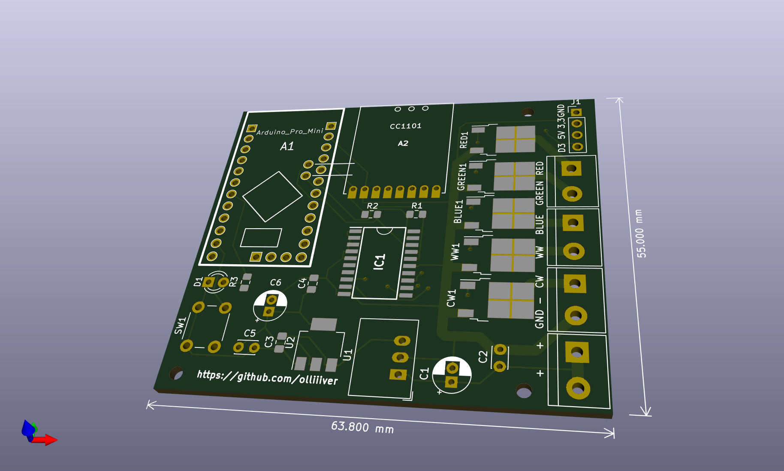
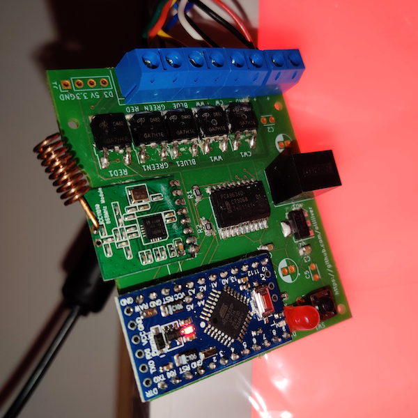

# Homematic 5-channel LED dimmer PCB for Arduino using CC1101 (KiCad)

Arduino sketch can be found here:

https://github.com/olliiiver/AskSinPP-rgbwwcw-dimmer

## Features

- 12-24 volt

## BOM

- PCA9634PW
- Arduino Pro Mini https://store.arduino.cc/arduino-pro-mini
- CC1101 board (from eBay)
- N-Channel MOSFET (IRL540N 30A 100V)
- Recom R-78E5.0-0.5
- AMS1117-3.3
- 10K resistors
- 100 nF / 10 uF capacitors

## TODO

- Add ground pad

## Images

